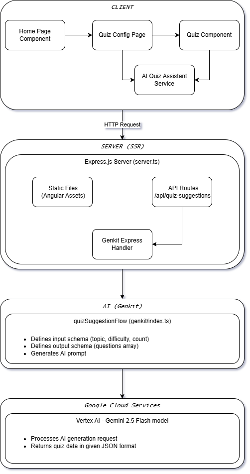

# Flash Quiz

An AI-powered quiz generation web application built with Angular and Google's Genkit AI framework. Flash Quiz uses Google's Vertex AI (Gemini 2.5 Flash model) to generate customizable quizzes on any topic with varying difficulty levels.

🔗 **[Live Demo](https://flash-quiz-452537186612.us-central1.run.app/)** | 💻 **[Source Code](https://github.com/yourusername/flash-quiz)**

## 📋 Table of Contents

- [Architecture Overview](#architecture-overview)
- [Tech Stack](#tech-stack)
- [Project Structure](#project-structure)
- [Getting Started](#getting-started)
- [Local Development](#local-development)
- [Building & Testing](#building--testing)
- [Deployment](#deployment)
- [Additional Resources](#additional-resources)

## 🏗️ Architecture Overview

### Application Architecture

FlashQuiz is built using a full-stack architecture that combines Angular's server-side rendering capabilities with AI-powered backend services.



### Key Architectural Components

#### 1. **Frontend (Angular 21)**

- **Standalone Components**: Uses Angular's standalone component architecture
- **Signal-based State Management**: Leverages Angular signals for reactive state
- **Server-Side Rendering (SSR)**: Pre-renders pages for better SEO and initial load performance
- **Routing**: Client-side routing with Angular Router

#### 2. **Backend (Express + Angular SSR)**

- **Express Server**: Serves both the Angular SSR application and API endpoints
- **API Routes**: RESTful endpoint (`/api/quiz-suggestions`) for quiz generation
- **Static Asset Serving**: Serves compiled Angular assets
- **CORS Support**: Configured for cross-origin requests

#### 3. **AI Integration (Genkit + Vertex AI)**

- **Genkit Framework**: Google's AI orchestration framework for structured AI flows
- **Zod Schema Validation**: Type-safe input/output validation
- **Vertex AI**: Integration with Google's managed AI services
- **Gemini 2.5 Flash**: Efficient LLM for quiz generation

### Data Flow

1. **User Input** → User configures quiz (topic, difficulty, number of questions)
2. **Client Request** → `AiQuizAssistant` service sends quiz configuration to `/api/quiz-suggestions`
3. **Server Processing** → Express routes request to Genkit flow handler
4. **AI Generation** → Genkit flow creates structured prompt and calls Vertex AI
5. **Response** → Gemini model returns JSON-formatted quiz questions
6. **Validation** → Zod schema validates response structure
7. **Client Rendering** → Angular components display quiz to user
8. **User Interaction** → Quiz component tracks answers and calculates score

### Component Hierarchy

```
App (Root)
├── HomePage
│   └── Routes to QuizConfigPage
├── QuizConfigPage
│   ├── QuizConfig (Configuration Form)
│   └── Quiz (Main Quiz Interface)
│       └── QuizResult (Results Display)
└── Services
    └── AiQuizAssistant (AI Integration Service)
```

## 🛠️ Tech Stack

### Frontend

- **Angular 21.0** - Modern web framework with signals and SSR
- **TypeScript** - Type-safe JavaScript
- **Lucide Angular** - Icon library
- **RxJS 7.8** - Reactive programming library

### Backend

- **Node.js** - JavaScript runtime
- **Express 5.2** - Web server framework
- **Angular SSR** - Server-side rendering

### AI & Machine Learning

- **Genkit 1.26** - AI orchestration framework
- **Vertex AI** - Google Cloud AI platform
- **Gemini 2.5 Flash** - Large language model (LLM)
- **Zod 3.25** - Schema validation

### Cloud & Deployment

- **Google Cloud Run** - Serverless container platform
- **Docker** - Containerization
- **Google Cloud Build** - CI/CD

## 📁 Project Structure

```
flash-quiz/
├── src/
│   ├── app/                          # Angular application core
│   │   ├── app.ts                    # Root component
│   │   ├── app.routes.ts             # Client-side routes
│   │   ├── app.config.ts             # App configuration
│   │   └── app.config.server.ts      # SSR configuration
│   │
│   ├── components/                   # Angular components
│   │   ├── home-page/                # Landing page
│   │   ├── quiz-config-page/         # Quiz configuration page
│   │   ├── quiz-config/              # Configuration form
│   │   ├── quiz/                     # Quiz interface
│   │   └── quiz-result/              # Results display
│   │
│   ├── services/                     # Business logic services
│   │   └── ai-quiz-assistant.ts      # AI quiz generation service
│   │
│   ├── models/                       # TypeScript interfaces
│   │   └── quiz.model.ts             # Quiz data models
│   │
│   ├── genkit/                       # AI integration layer
│   │   └── index.ts                  # Genkit flows & configuration
│   │
│   ├── server.ts                     # Express server setup
│   ├── main.ts                       # Client-side entry point
│   ├── main.server.ts                # Server-side entry point
│   └── index.html                    # HTML template
│
├── public/                           # Static assets
│   └── images/                       # Image files
│
├── .angular/                         # Angular build cache
├── .vscode/                          # VS Code configuration
│
├── angular.json                      # Angular CLI configuration
├── package.json                      # Dependencies & scripts
├── tsconfig.json                     # TypeScript configuration
├── Dockerfile                        # Container definition
├── .dockerignore                     # Docker ignore rules
├── .env                              # Environment variables (local)
├── service-account.json              # GCP service account key
├── deploy.sh                         # Linux/Mac deployment script
└── deploy.ps1                        # Windows deployment script
```

### Key Files Explained

- **`src/genkit/index.ts`**: Defines the `quizSuggestionFlow` that orchestrates AI prompt-based quiz generation using Vertex AI
- **`src/services/ai-quiz-assistant.ts`**: Angular service that interfaces with the Genkit API endpoint
- **`src/server.ts`**: Express server that handles SSR / API routes
- **`service-account.json`**: Google Cloud service account credentials (not committed to version control)

## 🚀 Getting Started

### Prerequisites

Before setting up the project locally, ensure you have the following installed:

1. **Node.js & npm**

   - Node.js version 18.x or higher
   - npm version 11.x or higher
   - Download from: https://nodejs.org/

2. **Angular CLI**

   ```bash
   npm install -g @angular/cli@21
   ```

3. **Google Cloud Account** (for AI features)

   - Create account at: https://cloud.google.com/
   - Enable Vertex AI API in your project
   - Create a service account with Vertex AI permissions

### Google Cloud Setup

To enable AI quiz generation, you need to set up Google Cloud credentials:

1. **Create a Google Cloud Project**

   ```bash
   # Install gcloud CLI: https://cloud.google.com/sdk/docs/install
   gcloud auth login
   gcloud projects create your-project-id
   gcloud config set project your-project-id
   ```

2. **Enable Required APIs**

   ```bash
   gcloud services enable aiplatform.googleapis.com
   gcloud services enable cloudbuild.googleapis.com
   ```

3. **Create Service Account**

   ```bash
   gcloud iam service-accounts create flash-quiz-sa \
     --description="Service account for FlashQuiz" \
     --display-name="FlashQuiz Service Account"

   # Grant Vertex AI User role
   gcloud projects add-iam-policy-binding your-project-id \
     --member="serviceAccount:flash-quiz-sa@your-project-id.iam.gserviceaccount.com" \
     --role="roles/aiplatform.user"

   # Download service account key
   gcloud iam service-accounts keys create service-account.json \
     --iam-account=flash-quiz-sa@your-project-id.iam.gserviceaccount.com
   ```

4. **Configure Environment Variables**

   Create a `.env` file in the project root:

   ```env
   GCLOUD_PROJECT=your-project-id
   GCLOUD_LOCATION=us-central1
   GOOGLE_APPLICATION_CREDENTIALS=./service-account.json
   GOOGLE_GENKIT_ENVIRONMENT=dev
   NODE_ENV=development
   PORT=4000
   ```

   ⚠️ **Security Note**: Never commit `service-account.json` or `.env` to version control!

## 💻 Local Development

### Installation

1. **Clone or extract the project**

   ```bash
   cd flash-quiz
   ```

2. **Install dependencies**

   ```bash
   npm install
   ```

3. **Configure Google Cloud credentials** (see Google Cloud Setup above)

4. **Verify setup**
   ```bash
   npm run build
   ```

### Running the Development Server

#### Option 1: Angular Development Server (Client-Only)

For rapid frontend development without SSR:

```bash
npm start
# or
ng serve
```

- Opens at: http://localhost:4200/
- Hot reload enabled
- No SSR or AI features (mock data only)

#### Option 2: SSR Development Server (Full Stack)

For full-stack development with AI features:

```bash
# Build the application
npm run build

# Start the SSR server
npm run serve:ssr:flash-quiz
```

- Opens at: http://localhost:4000/
- Includes SSR and AI quiz generation
- Requires Google Cloud credentials

### Development Workflow

1. **Make code changes** in `src/` directory
2. **For client-only changes**: Use `npm start` for hot reload
3. **For server/AI changes**:
   - Run `npm run build` to rebuild
   - Restart with `npm run serve:ssr:flash-quiz`
4. **Test changes** in browser

### Using Mock Data (Optional)

To develop without Google Cloud credentials:

1. Open `src/services/ai-quiz-assistant.ts`
2. Set `USE_MOCK_DATA = true`
3. The service will return mock quiz questions instead of calling the AI

## 🧪 Building & Testing

### Building for Production

```bash
npm run build
```

This command:

- Compiles TypeScript to JavaScript
- Bundles and optimizes client-side code
- Builds server-side rendering bundle
- Outputs to `dist/flash-quiz/`

### Build Output Structure

```
dist/flash-quiz/
├── browser/              # Client-side bundle
│   ├── index.html
│   ├── main-*.js
│   └── styles-*.css
└── server/               # SSR bundle
    └── server.mjs
```

## 🚢 Deployment

### Deployment to Google Cloud Run

This application is optimized for serverless deployment on Google Cloud Run.

#### Prerequisites

1. Install [Google Cloud SDK](https://cloud.google.com/sdk/docs/install)
2. Authenticate with Google Cloud:
   ```bash
   gcloud auth login
   gcloud config set project your-project-id
   ```
3. Enable required APIs:
   ```bash
   gcloud services enable cloudbuild.googleapis.com run.googleapis.com aiplatform.googleapis.com
   ```

#### Quick Deploy

**Windows (PowerShell):**

```powershell
.\deploy.ps1
```

**Linux/Mac:**

```bash
chmod +x deploy.sh
./deploy.sh
```

The deployment script will:

1. Build the Angular application
2. Build and push Docker container to Google Container Registry
3. Deploy to Cloud Run with appropriate environment variables

#### Manual Deployment

If you prefer to deploy manually:

```bash
# 1. Build the application
npm run build

# 2. Build and push Docker image
gcloud builds submit --tag gcr.io/your-project-id/flash-quiz

# 3. Deploy to Cloud Run
gcloud run deploy flash-quiz \
  --image gcr.io/your-project-id/flash-quiz \
  --platform managed \
  --region us-central1 \
  --allow-unauthenticated \
  --set-env-vars "GOOGLE_GENKIT_ENVIRONMENT=prod,GCLOUD_PROJECT=your-project-id,GCLOUD_LOCATION=us-central1,NODE_ENV=production"
```

#### Environment Variables

Production environment variables set during deployment:

| Variable                    | Value            | Description                  |
| --------------------------- | ---------------- | ---------------------------- |
| `GOOGLE_GENKIT_ENVIRONMENT` | `prod`           | Genkit environment mode      |
| `GCLOUD_PROJECT`            | Your project ID  | GCP project identifier       |
| `GCLOUD_LOCATION`           | `us-central1`    | GCP region for Vertex AI     |
| `NODE_ENV`                  | `production`     | Node.js environment          |
| `PORT`                      | Set by Cloud Run | Server port (typically 8080) |

#### Viewing Deployment Logs

```bash
gcloud run services logs tail flash-quiz --region=us-central1
```

#### Updating the Deployment

To deploy updates, run the deploy script again:

```bash
./deploy.sh  # or deploy.ps1 on Windows
```

### Docker Deployment (Alternative)

You can also run the application using Docker locally:

```bash
# Build the image
docker build -t flash-quiz .

# Run the container
docker run -p 8080:8080 \
  -e GCLOUD_PROJECT=your-project-id \
  -e GCLOUD_LOCATION=us-central1 \
  -e GOOGLE_GENKIT_ENVIRONMENT=prod \
  -e NODE_ENV=production \
  flash-quiz
```

Access the application at: http://localhost:8080

## 🔧 Configuration

### TypeScript Configuration

- **`tsconfig.json`**: Base TypeScript configuration
- **`tsconfig.app.json`**: Client-side compilation settings
- **`tsconfig.spec.json`**: Test compilation settings

### Angular Configuration

- **`angular.json`**: Angular CLI workspace configuration
  - Build configurations (development/production)
  - File replacements
  - Asset management
  - SSR settings

## 📝 Additional Resources

### Documentation

- [Angular Documentation](https://angular.dev)
- [Angular CLI Reference](https://angular.dev/tools/cli)
- [Genkit Documentation](https://firebase.google.com/docs/genkit)
- [Vertex AI Documentation](https://cloud.google.com/vertex-ai/docs)
- [Google Cloud Run Documentation](https://cloud.google.com/run/docs)

## 🐛 Troubleshooting

### Common Issues

**Issue**: "Cannot find module 'genkit'"

- **Solution**: Run `npm install` to ensure all dependencies are installed

**Issue**: AI quiz generation fails

- **Solution**: Verify `service-account.json` exists and `.env` has correct `GCLOUD_PROJECT`

**Issue**: Port 4000 already in use

- **Solution**: Change `PORT` in `.env` or stop the conflicting process

**Issue**: Build fails with TypeScript errors

- **Solution**: Run `npm install` to ensure compatible dependency versions

## 📄 License

This project was generated with Angular CLI and is provided as-is for educational purposes.

---
